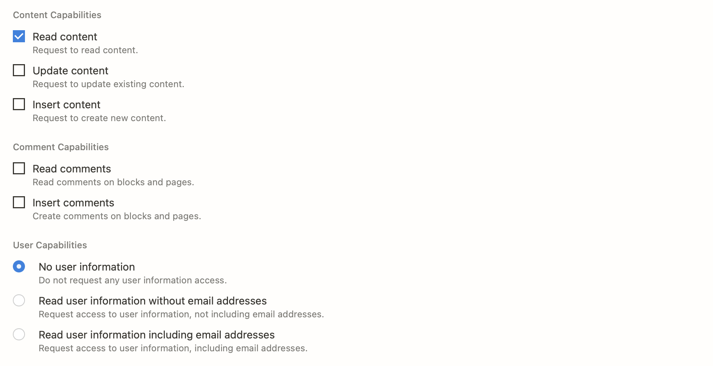

An Alfred workflow to search for Notion pages in your workspace.

# How to Use

1. [Generate an integration key](https://www.notion.so/my-integrations/) for your workspace. [See instructions on configuration options below](#generating-an-integration-key).
2. Grant the workflow access to pages ([see section below](#granting-access-to-pages)).
3. Download and install the workflow.
4. Enter your integration key when prompted. You may also optionally choose to open links in the Notion desktop client.
5. Start searching for pages by typing `ns [search query]`. Select a search result to open it, or `⌘+select` to copy the page link.

# Generating an Integration Key

When creating a new integration, configure the capabilities section as follows:

# Granting Access to Pages

Because this workflow uses the official Notion API, you must grant the workflow access to pages that you want to appear in search results.
